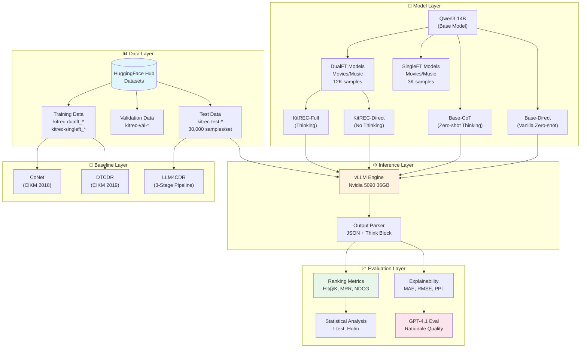
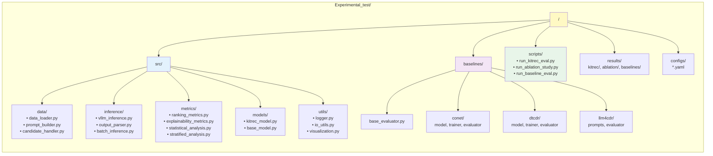
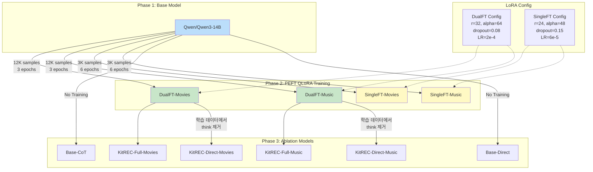
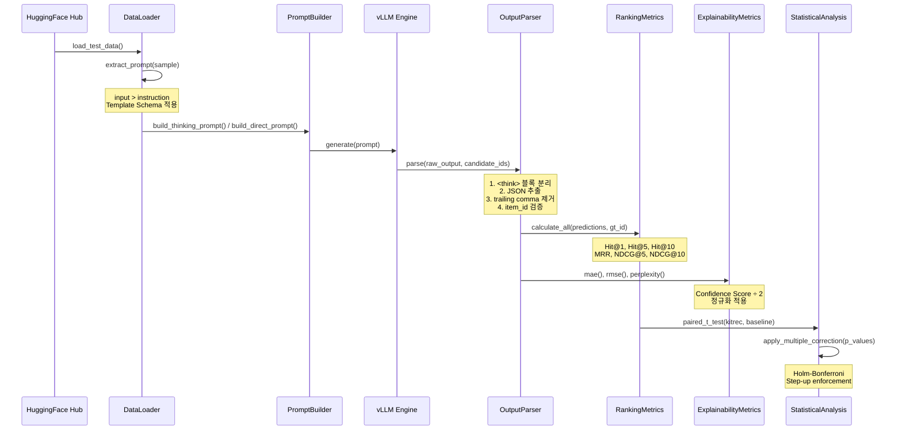
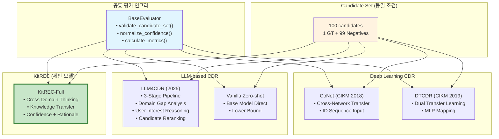
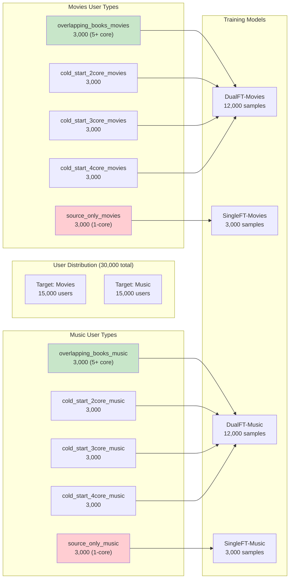
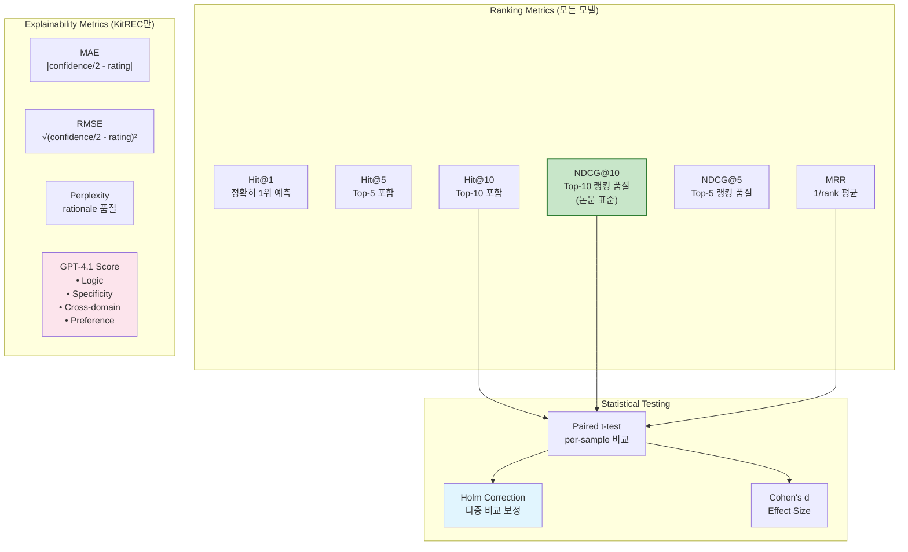
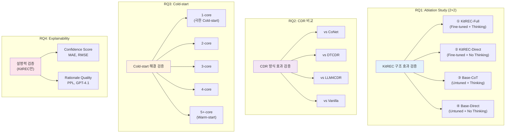
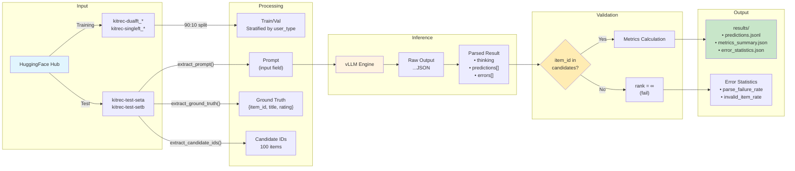
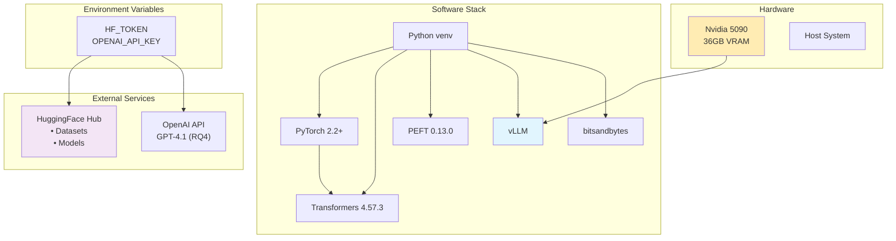

# KitREC 시스템 아키텍처

**마지막 업데이트:** 2025-12-07  
**버전:** 1.0

---

## 1. 전체 시스템 아키텍처

---

## 2. 프로젝트 폴더 구조

---

## 3. 모델 학습 파이프라인

---

## 4. 추론 및 평가 파이프라인

---

## 5. Baseline 비교 아키텍처

---

## 6. User Type 및 Core Level 매핑

---

## 7. 평가 지표 체계

---

## 8. Research Questions 실험 매핑

---

## 9. 데이터 흐름 다이어그램

---

## 10. 환경 구성

---

## 참조 문서

| 문서 | 설명 |
|------|------|
| `CLAUDE.md` | 프로젝트 상세 가이드 |
| `detail_task_plan.md` | 작업 계획서 |
| `IMPLEMENTATION_SUMMARY.md` | 구현 요약 |
| `DATA_FLOW.md` | 데이터 흐름 상세 |
| `RQ_EXPERIMENT_MAP.md` | RQ별 실험 매핑 |

