# KitREC 데이터 흐름 다이어그램

**마지막 업데이트:** 2025-12-07  
**버전:** 1.0

---

## 1. HuggingFace 데이터셋 구조

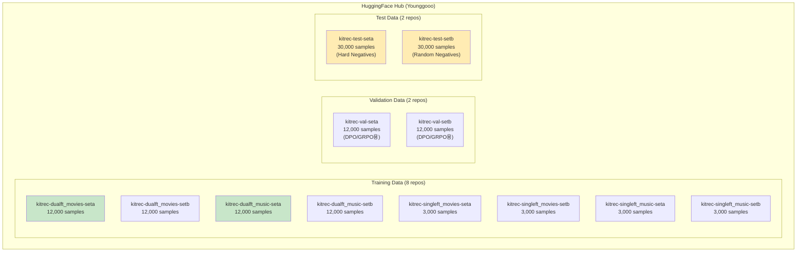

---

## 2. 데이터 스키마

### Training Data Schema
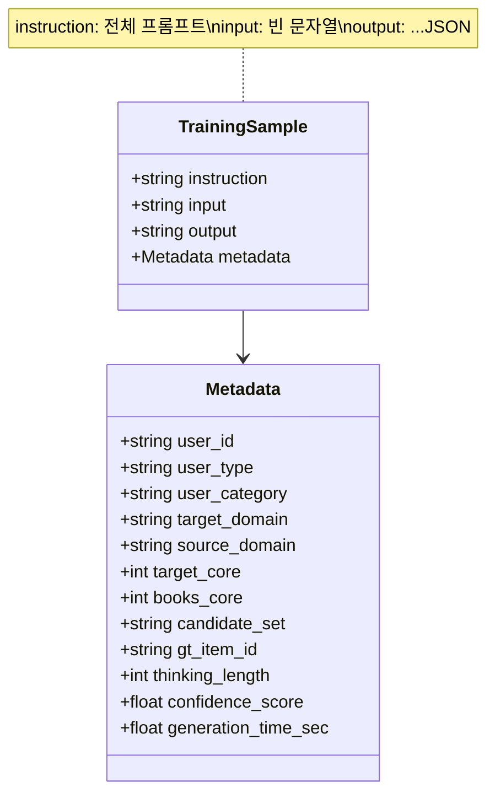

### Val/Test Data Schema
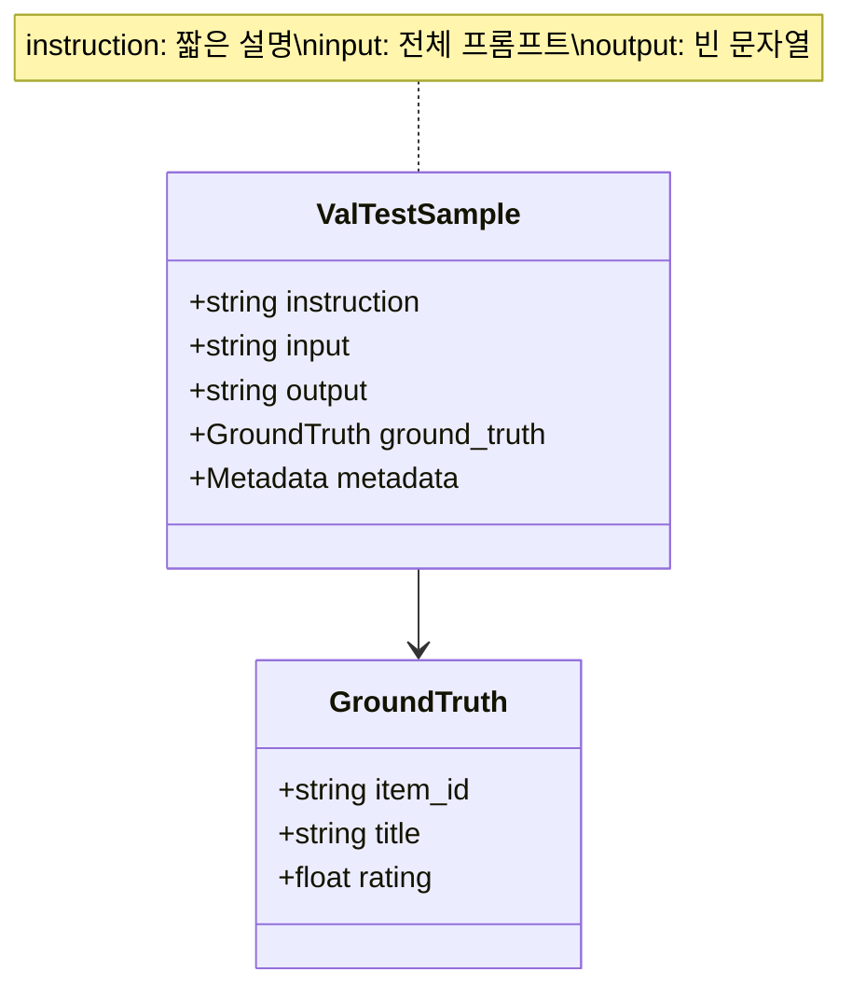

---

## 3. 프롬프트 추출 흐름

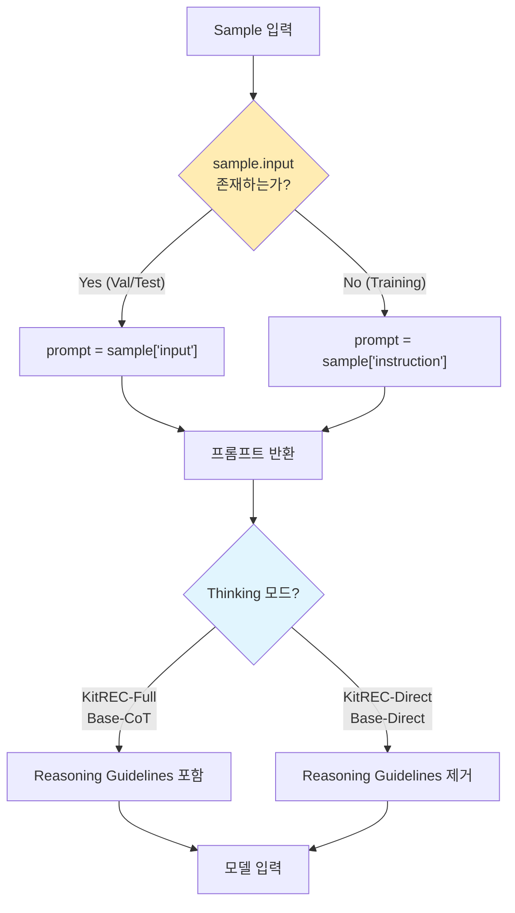

---

## 4. 모델 출력 파싱 흐름

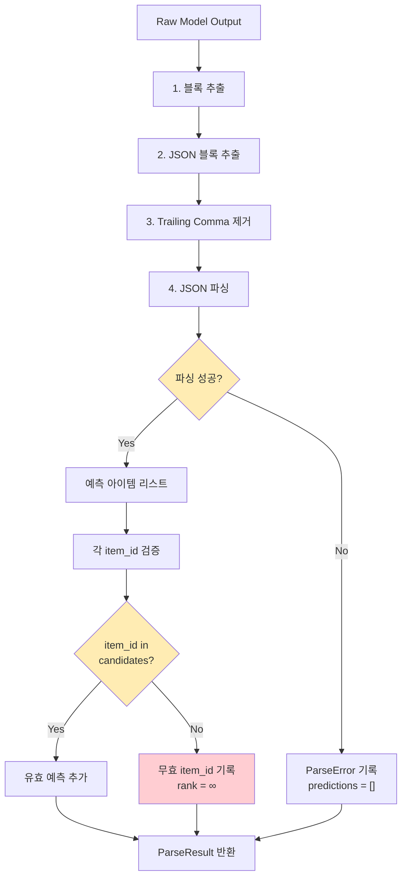

---

## 5. Candidate Set 처리

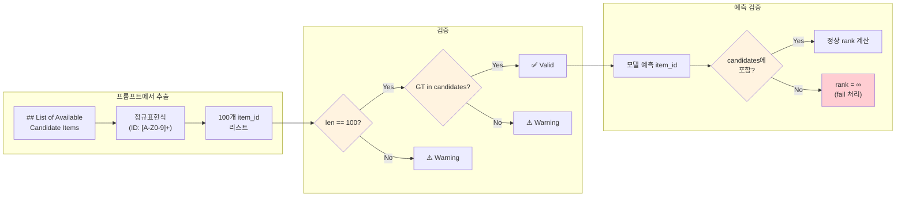

---

## 6. Confidence Score 정규화

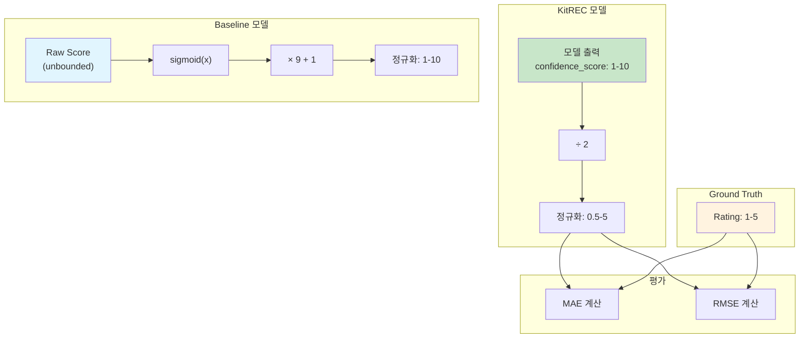

---

## 7. User Type별 데이터 분포

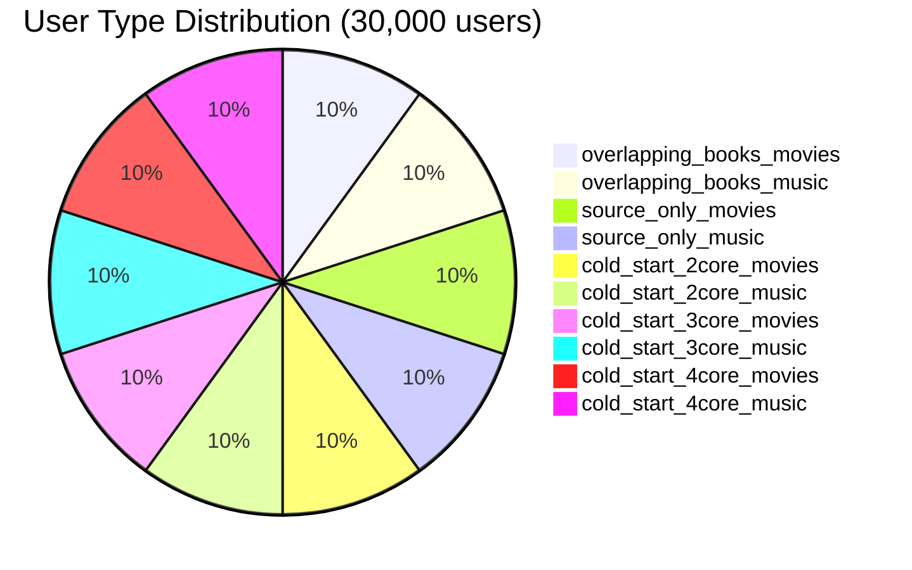

---

## 8. Train/Test 분리 검증

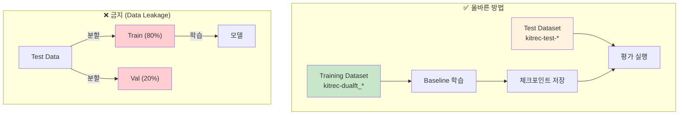

---

## 9. 결과 저장 구조

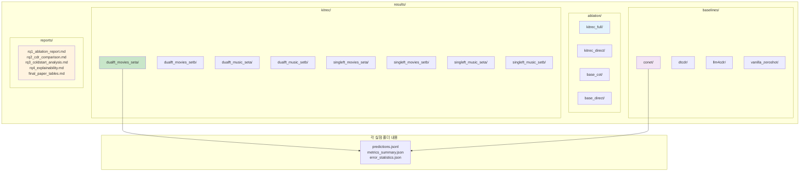

---

## 10. 메트릭 계산 흐름

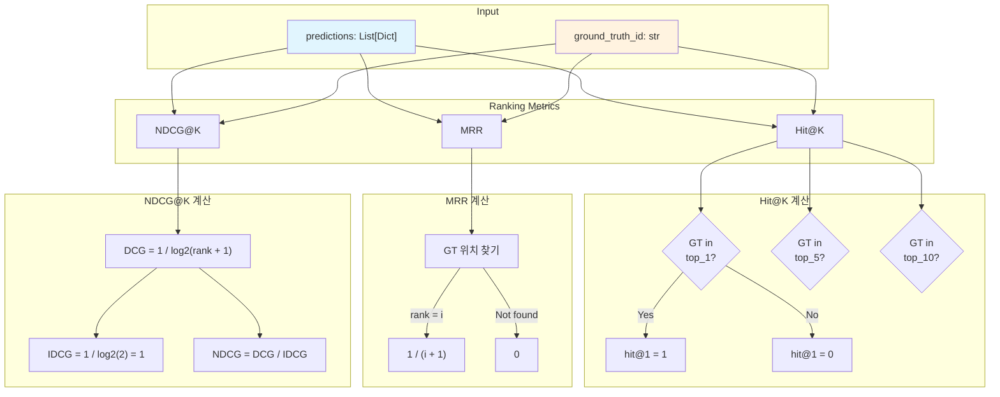

---

## 11. 통계 분석 흐름

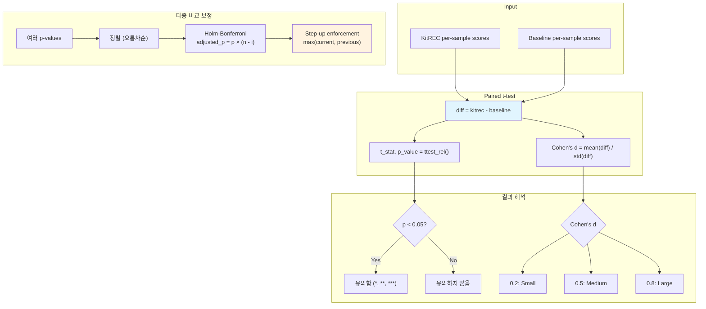

---

## 12. GPT-4.1 평가 흐름 (RQ4)

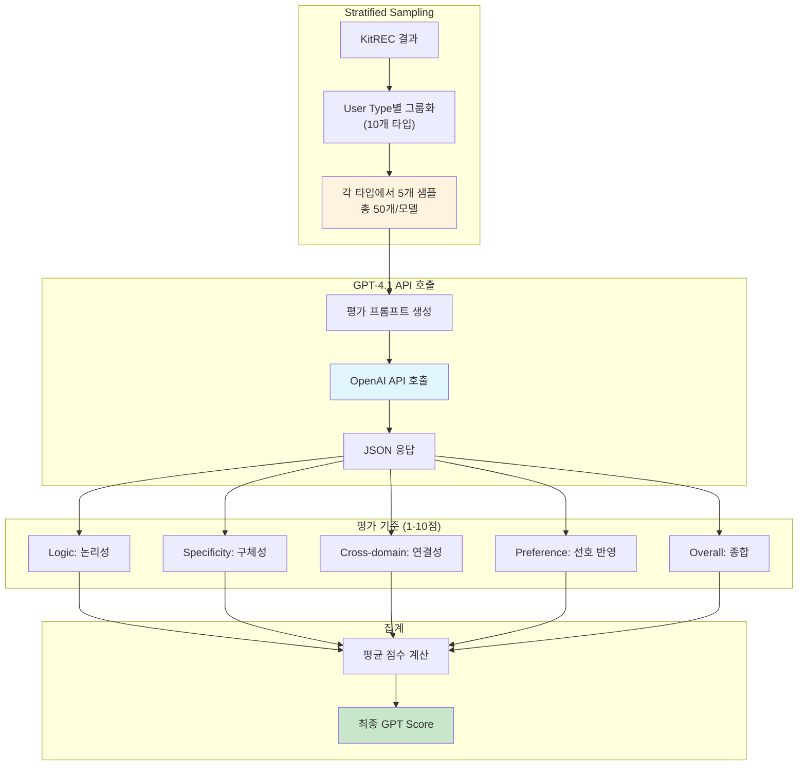

---

## 요약: 핵심 데이터 흐름 체크포인트

| # | 체크포인트 | 검증 방법 |
|---|-----------|----------|
| 1 | `input` 필드에서 프롬프트 추출 (Val/Test) | 단위 테스트 |
| 2 | Candidate Set = 100개 | `len(candidates) == 100` |
| 3 | GT가 Candidate에 포함 | `gt_id in candidates` |
| 4 | 후보군 외 item_id → rank = ∞ | 오류율 로깅 |
| 5 | Confidence ÷ 2 정규화 | MAE/RMSE 범위 검증 |
| 6 | Train/Test 완전 분리 | 별도 데이터셋 사용 |
| 7 | per-sample 메트릭 수집 | t-test 입력 준비 |

