# KitREC 연구 질문별 실험 매핑

**마지막 업데이트:** 2025-12-07  
**버전:** 1.0

---

## 개요

이 문서는 KitREC 논문의 4개 Research Questions(RQ)에 대한 실험 설계, 비교 대상, 메트릭, 예상 결과를 상세히 기술합니다.

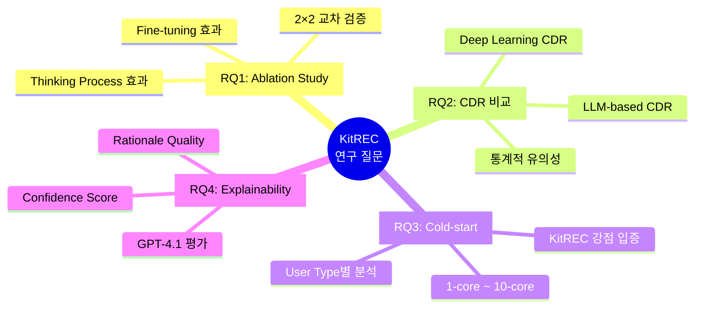

---

## RQ1: KitREC 구조의 효과성 검증 (Ablation Study)

### 연구 질문
> "KitREC의 성능 향상이 단순한 Fine-tuning 덕분인지, 아니면 설계된 Thinking Process(CoT) 덕분인지?"

### 실험 설계: 2×2 교차 검증

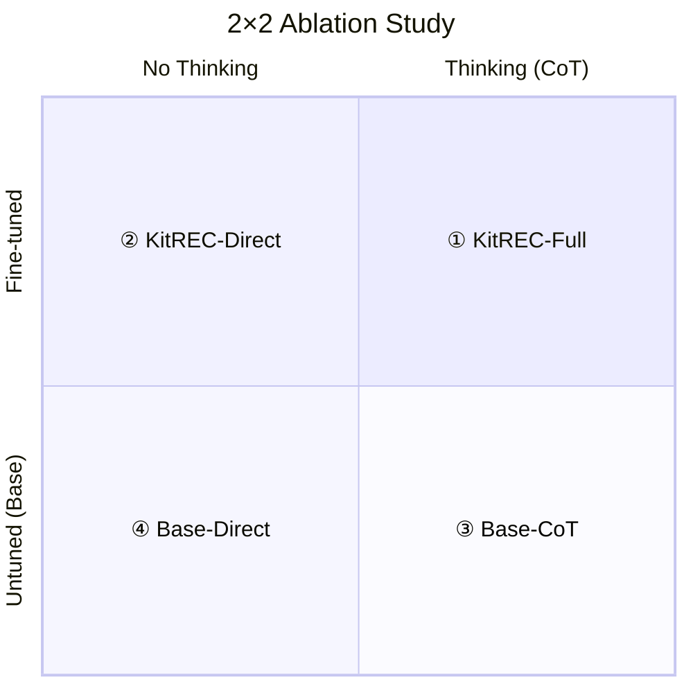

### 비교 모델 상세

| 모델 | 학습 | 추론 | 설명 |
|------|------|------|------|
| **① KitREC-Full** | Fine-tuned | Thinking | 제안 모델 (Full) |
| **② KitREC-Direct** | Fine-tuned | No Thinking | `<think>` 제거 학습 |
| **③ Base-CoT** | Untuned | Thinking | Zero-shot CoT |
| **④ Base-Direct** | Untuned | No Thinking | Vanilla Zero-shot |

### 프롬프트 차이

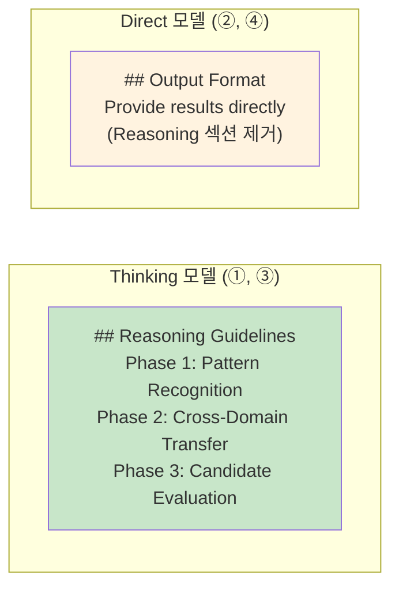

### KitREC-Direct 생성 방법 (Option A 권장)

```python
# Training 데이터에서 <think> 블록 제거
def remove_thinking_block(output: str) -> str:
    pattern = r'<think>[\s\S]*?</think>\s*'
    return re.sub(pattern, '', output).strip()

# 별도 학습 데이터 생성 후 모델 학습
```

### 평가 메트릭

| 메트릭 | 범위 | 핵심 의미 |
|--------|------|----------|
| **Hit@10** | 0-1 | Top-10 포함 여부 |
| **NDCG@10** | 0-1 | 랭킹 품질 (논문 표준) |
| **MRR** | 0-1 | 평균 역순위 |

### 예상 결과 패턴

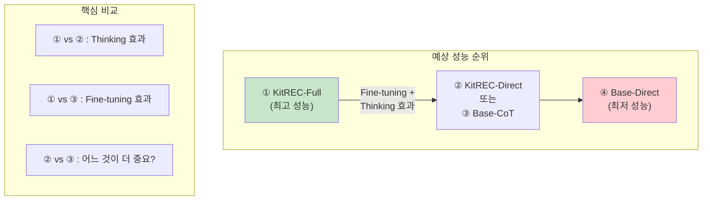

### 통계 검정

```python
# RQ1 통계 검정
comparisons = [
    ("KitREC-Full", "KitREC-Direct"),   # Thinking 효과
    ("KitREC-Full", "Base-CoT"),         # Fine-tuning 효과
    ("KitREC-Direct", "Base-Direct"),    # Fine-tuning 효과 (No Thinking)
    ("Base-CoT", "Base-Direct"),         # Thinking 효과 (Untuned)
]

for a, b in comparisons:
    result = paired_t_test(scores[a], scores[b])
    print(f"{a} vs {b}: p={result['p_value']:.4f}, d={result['cohens_d']:.3f}")
```

---

## RQ2: CDR 방식의 효과성 검증 (Baseline 비교)

### 연구 질문
> "KitREC이 기존 Cross-Domain Recommendation 방법들보다 효과적인가?"

### 비교 Baseline

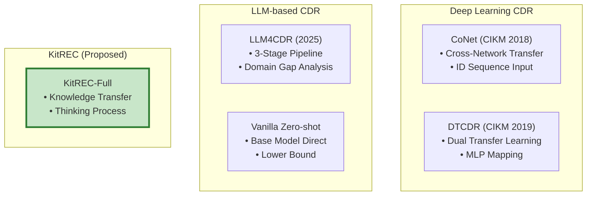

### 공정한 비교 조건

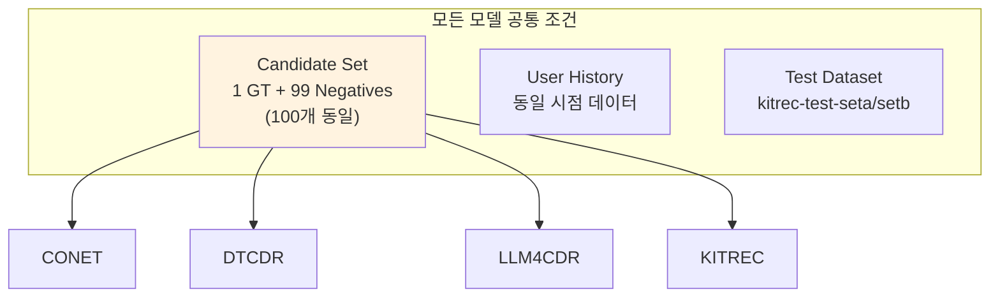

### LLM4CDR 구현 차이점 (중요!)

| 항목 | 원 논문 | KitREC 구현 |
|------|---------|-------------|
| **Positive** | 3개 | 1개 |
| **Negative** | 20-30개 | 99개 |
| **총 후보** | ~30개 | 100개 |
| **난이도** | 쉬움 | 어려움 |
| **Target History** | 미사용 | 포함 |

> **논문 명시 필요**: "LLM4CDR was re-evaluated using KitREC protocol (1 GT + 99 negatives) for fair comparison."

### 평가 메트릭

| 메트릭 | 중요도 | 설명 |
|--------|--------|------|
| **Hit@1** | ⭐⭐⭐ | 정확히 1위 예측 |
| **Hit@5** | ⭐⭐ | Top-5 포함 |
| **Hit@10** | ⭐⭐⭐ | Top-10 포함 (핵심) |
| **MRR** | ⭐⭐⭐ | 랭킹 품질 |
| **NDCG@5** | ⭐⭐ | Top-5 품질 |
| **NDCG@10** | ⭐⭐⭐ | Top-10 품질 (논문 표준) |

### 통계적 유의성 검정

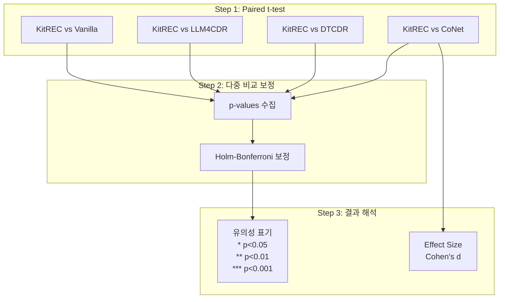

### 논문 테이블 형식

```latex
\begin{table}[h]
\centering
\caption{Performance comparison on KitREC test set}
\begin{tabular}{lcccccc}
\toprule
Model & Hit@1 & Hit@5 & Hit@10 & MRR & NDCG@5 & NDCG@10 \\
\midrule
CoNet & 0.xxx & 0.xxx & 0.xxx & 0.xxx & 0.xxx & 0.xxx \\
DTCDR & 0.xxx & 0.xxx & 0.xxx & 0.xxx & 0.xxx & 0.xxx \\
LLM4CDR & 0.xxx & 0.xxx & 0.xxx & 0.xxx & 0.xxx & 0.xxx \\
Vanilla & 0.xxx & 0.xxx & 0.xxx & 0.xxx & 0.xxx & 0.xxx \\
\midrule
\textbf{KitREC} & \textbf{0.xxx}*** & \textbf{0.xxx}** & \textbf{0.xxx}*** & ... \\
\bottomrule
\end{tabular}
\end{table}
```

---

## RQ3: Cold-start/Sparse 문제 해결 (User Type별 분석)

### 연구 질문
> "KitREC이 다양한 Cold-start 수준에서 효과적인가? 특히 극한 Cold-start(1-core)에서도 성능이 나오는가?"

### Core Level 정의

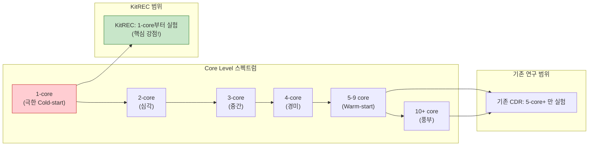

### User Type → Model 매핑

| User Type | Core Level | Training Model | 샘플 수 |
|-----------|------------|----------------|---------|
| source_only_movies | 1-core | SingleFT-Movies | 3,000 |
| source_only_music | 1-core | SingleFT-Music | 3,000 |
| cold_start_2core_movies | 2-core | DualFT-Movies | 3,000 |
| cold_start_2core_music | 2-core | DualFT-Music | 3,000 |
| cold_start_3core_movies | 3-core | DualFT-Movies | 3,000 |
| cold_start_3core_music | 3-core | DualFT-Music | 3,000 |
| cold_start_4core_movies | 4-core | DualFT-Movies | 3,000 |
| cold_start_4core_music | 4-core | DualFT-Music | 3,000 |
| overlapping_books_movies | 5+-core | DualFT-Movies | 3,000 |
| overlapping_books_music | 5+-core | DualFT-Music | 3,000 |

### 분석 방법

```python
def evaluate_by_user_type(samples, user_type_mapping):
    grouped = defaultdict(list)
    
    for sample in samples:
        user_type = user_type_mapping.get(sample.user_id, "unknown")
        metrics = evaluate_sample(sample)
        grouped[user_type].append(metrics)
    
    # Core Level별 집계
    core_level_results = {}
    for user_type, metrics_list in grouped.items():
        core = USER_TYPE_MAPPING[user_type]["core"]
        aggregated = aggregate_metrics(metrics_list)
        core_level_results[f"{core}-core"] = aggregated
    
    return core_level_results
```

### 예상 결과 시각화

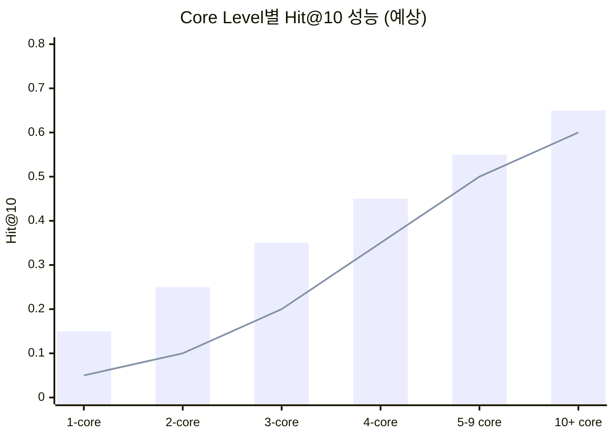

> **범례**: Bar = KitREC, Line = Best Baseline  
> **핵심 주장**: 1-4 core에서 KitREC과 Baseline 간 격차가 가장 큼

### 핵심 논문 주장

```
"Unlike existing CDR methods that only evaluate on users with 
5+ target interactions (warm-start), KitREC demonstrates strong 
performance even on extreme cold-start users with only 1 target 
interaction."
```

---

## RQ4: Confidence/Rationale 검증 (Explainability)

### 연구 질문
> "KitREC이 생성하는 Confidence Score와 Rationale이 신뢰할 수 있는가?"

### ⚠️ 중요: 평가 대상

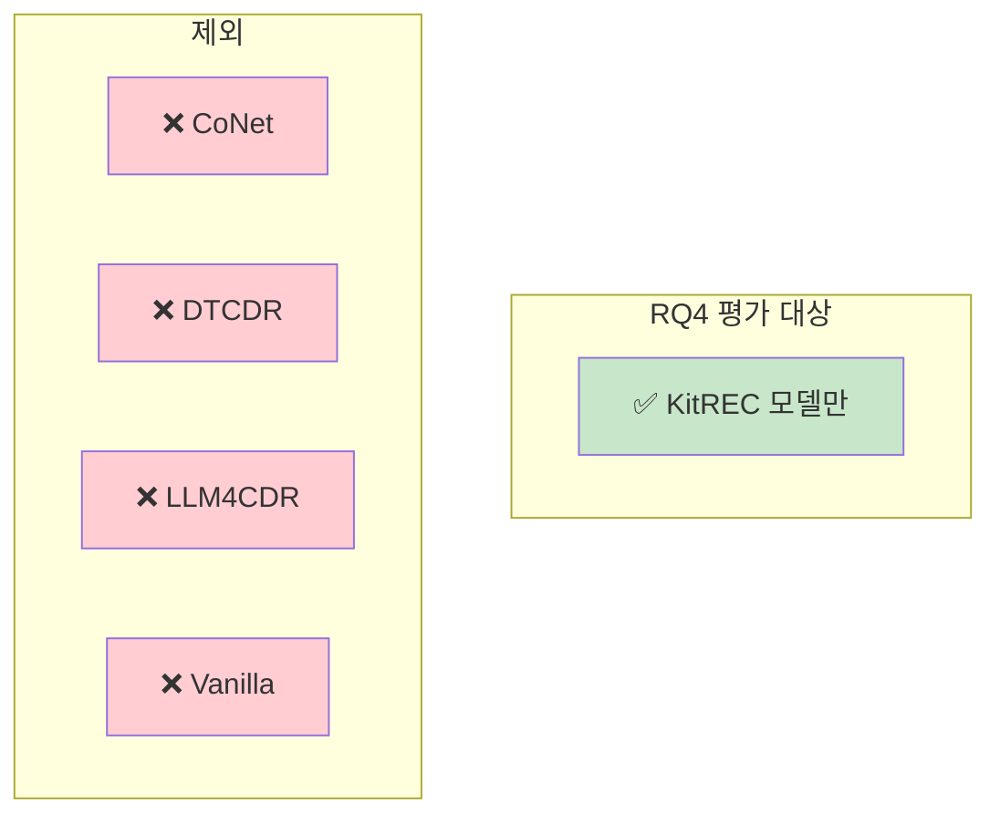

> **이유**: Baseline 모델들은 Confidence Score와 Rationale을 생성하지 않거나, 형식이 다름

### 평가 메트릭 체계

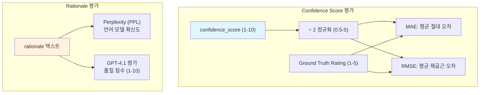

### GPT-4.1 평가 설계

#### Stratified Sampling (균등 추출)


#### 평가 기준 (4가지)

| 기준 | 영문 | 설명 | 점수 범위 |
|------|------|------|----------|
| **논리성** | Logic | 추천 이유가 논리적인가? | 1-10 |
| **구체성** | Specificity | 구체적인 근거를 제시하는가? | 1-10 |
| **Cross-domain 연결성** | Cross-domain | Source→Target 연결이 명확한가? | 1-10 |
| **선호 반영** | Preference | 사용자 히스토리를 잘 반영했는가? | 1-10 |

#### GPT-4.1 프롬프트

```python
EVALUATION_PROMPT = '''You are an expert evaluator for recommendation system explanations.

Evaluate the following rationale based on:
1. Logic (1-10): Is the reasoning logically coherent?
2. Specificity (1-10): Are specific items/preferences referenced?
3. Cross-domain (1-10): Is the connection between source and target domains clear?
4. Preference (1-10): Does it reflect the user's actual preferences?

User History:
{user_history}

Recommended Item:
{recommended_item}

Rationale to evaluate:
{rationale}

Respond ONLY with a JSON object:
{"logic": <1-10>, "specificity": <1-10>, "cross_domain": <1-10>, 
 "preference": <1-10>, "overall": <1-10>}
'''
```

### 결과 테이블 예시

```markdown
| Model | MAE ↓ | RMSE ↓ | PPL ↓ | Logic | Specificity | Cross-domain | Preference | Overall |
|-------|-------|--------|-------|-------|-------------|--------------|------------|---------|
| DualFT-Movies (A) | 0.xx | 0.xx | xx.x | x.x | x.x | x.x | x.x | x.x |
| DualFT-Movies (B) | 0.xx | 0.xx | xx.x | x.x | x.x | x.x | x.x | x.x |
| DualFT-Music (A) | 0.xx | 0.xx | xx.x | x.x | x.x | x.x | x.x | x.x |
| ... | ... | ... | ... | ... | ... | ... | ... | ... |
```

---

## 실험 실행 순서

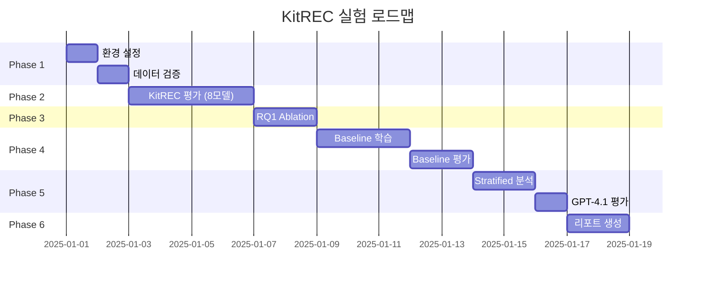

---

## 실행 명령어 요약

```bash
# RQ1: Ablation Study
python scripts/run_ablation_study.py --config configs/eval_config.yaml

# RQ2: Baseline 평가
python scripts/run_baseline_eval.py --baseline conet --target_domain movies
python scripts/run_baseline_eval.py --baseline dtcdr --target_domain movies
python scripts/run_baseline_eval.py --baseline llm4cdr --target_domain movies

# RQ3: Cold-start 분석 (KitREC 결과에서 User Type별 집계)
python scripts/run_kitrec_eval.py --model_name dualft_movies_seta --analyze_user_types

# RQ4: Explainability (KitREC만)
python scripts/run_explainability_eval.py --model_name dualft_movies_seta --gpt_eval
```

---

## 핵심 논문 인용 문구

### RQ1
> "The 2×2 ablation study demonstrates that both the fine-tuning process and the thinking mechanism contribute to KitREC's superior performance, with the combination achieving the best results."

### RQ2
> "KitREC significantly outperforms all baselines across all metrics (p < 0.01, paired t-test with Holm-Bonferroni correction)."

### RQ3
> "Most importantly, KitREC maintains competitive performance even in extreme cold-start scenarios (1-core), where traditional CDR methods fail to provide meaningful recommendations."

### RQ4
> "The generated rationales receive high scores (>7/10) on logic, specificity, and cross-domain connection according to GPT-4.1 evaluation, demonstrating KitREC's strong explainability."

